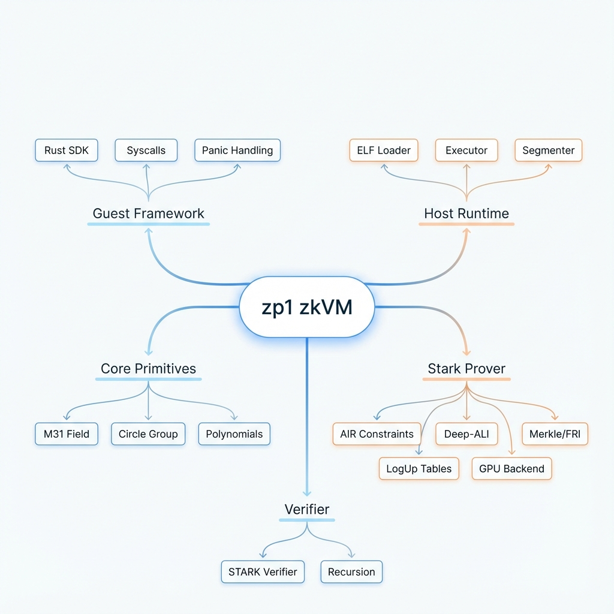
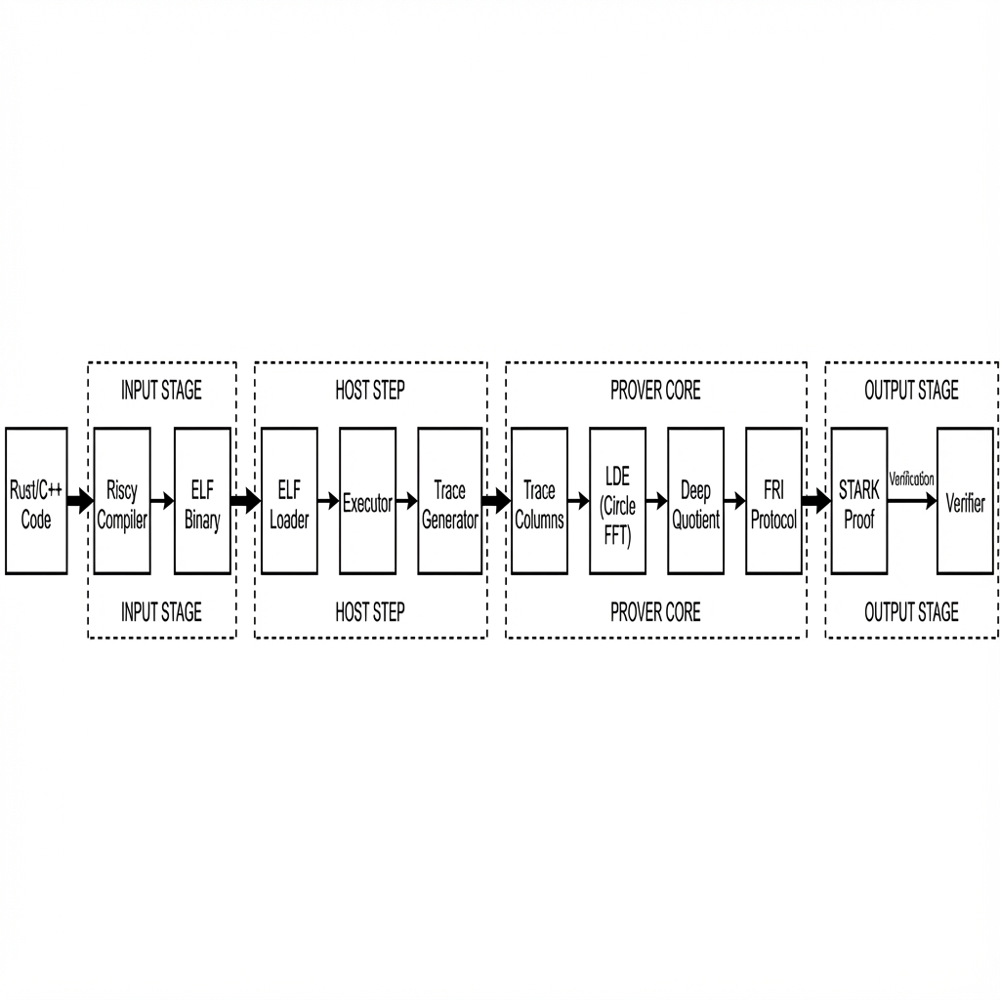
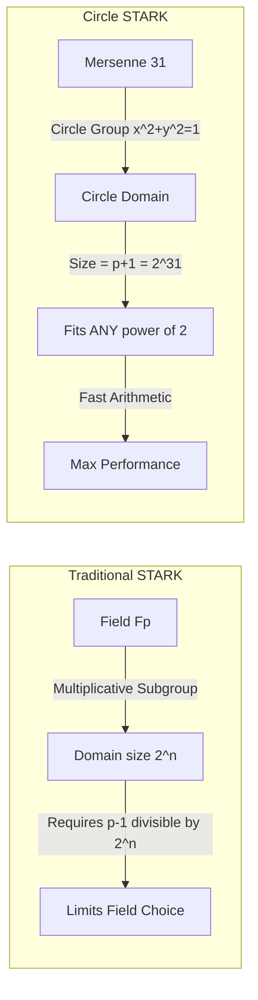

# zp1 Architecture: High-Performance zkVM Design

## 1. Executive Summary

**zp1** is designed as a next-generation Zero-Knowledge Virtual Machine (zkVM) targeting specific performance metrics:
-   **Proving Speed**: Maximized via small fields (Mersenne-31) and hardware acceleration (GPU/Metal).
-   **Soundness**: Ensuring 128-bit security via QM31 extension and DEEP-ALI STARKs.
-   **Developer Experience**: Standard RISC-V support allowing Rust/C++ guest programs.

The system leverages **Circle STARKs** over the **Mersenne-31 (M31)** field, which allows for highly efficient arithmetic on standard CPUs/GPUs while avoiding the overhead of larger prime fields (like Goldilocks or BabyBear) or elliptic curves (like BN254).

---

## 2. System Architecture Overview

The system follows a standard **Compiler -> VM -> Prover -> Verifier** pipeline.

---

## 3. Detailed Data Flow Architecture

The data flow moves from a high-level Rust program to a verifiable cryptographic proof.

---

## 4. Key Architectural Decisions & Logic

### 4.1. The Field Choice: Mersenne-31 (M31)
**Why?**
-   **Performance**: M31 ($2^{31}-1$) fits into a 32-bit register. Addition requires an integer add with a conditional subtract (or bitwise AND). Multiplication fits in a 64-bit word before reduction. This can be faster than Goldilocks ($2^{64}-2^{32}+1$) or BabyBear on some 32-bit/64-bit hardware.
-   **GPU Friendly**: GPUs excel at 32-bit arithmetic. M31 is native to GPU ALUs.

**Implication**:
-   Conventional FFTs require domains of size $2^n$. M31 is a Mersenne prime, so $M31 - 1$ is not highly divisible by 2. We cannot use standard FFTs efficiently.
-   **Solution**: **Circle FFT**. We work over the circle group $x^2 + y^2 = 1$ in M31. This group has size $2^{31}$, allowing efficient FFTs of any power-of-two size.

### 4.2. Lookup Arguments: LogUp vs. Lasso
**Current State**: The system uses `LogUp`.
**Constraint Logic**:
-   Instead of proving every bitwise operation (AND, XOR) with expensive polynomial equations (e.g., $a \cdot (1-a) = 0$ for 32 bits), we use **Lookup Tables**.
-   We compute $a \oplus b = c$. We check if the tuple $(a, b, c)$ exists in a precomputed "XOR Table".
-   **LogUp** converts this lookup check into a sum of rational functions: $\sum \frac{1}{x - t_i} = \sum \frac{m_i}{x - T_i}$.
-   **Optimization**: This dramatically reduces degree of constraints for bitwise operations, which are dominant in SHA-256 and Keccak.

### 4.3. Precompiles & Acceleration
**Design Goal**: syscalls for heavy crypto.
-   Instead of running SHA-256 as 10,000 RISC-V instructions, the VM traps the execution.
-   The **Executor** computes the hash natively.
-   A dedicated **Chip (Table)** is filled with the input/output trace of the hash.
-   The **Prover** proves the Chip validity separately and connects it to the main CPU bus via Lookups.

---

## 5. Logical Gap Analysis: Improvements Needed

| Feature | Current Status | Recommended Upgrade | Why? |
| :--- | :--- | :--- | :--- |
| **Recursion** | `snark` wrappers exist | **Segmented STARK Recursion** | To prove long programs, split trace into N segments. Recursively prove each segment into a single proof. |
| **Memory** | Basic consistency | **Paged Memory / Write-once** | For massive memory usage, simpler access patterns or "memory-as-external-lookup" can save constraints. |
| **GPU Acceleration** | ✅ Native Metal kernels | **CUDA Parity** | Metal NTT/LDE implemented; CUDA kernels need runtime integration. |

---

## 6. Visualizing the "Circle STARK" Logic

Why Circle STARKs specifically?

Using M31 provides efficient integer math on CPUs/GPUs, but breaks traditional FFTs. The **Circle STARK** construction restores FFT capability via the geometry of the circle, enabling the combination of small fields with efficient FFTs.
